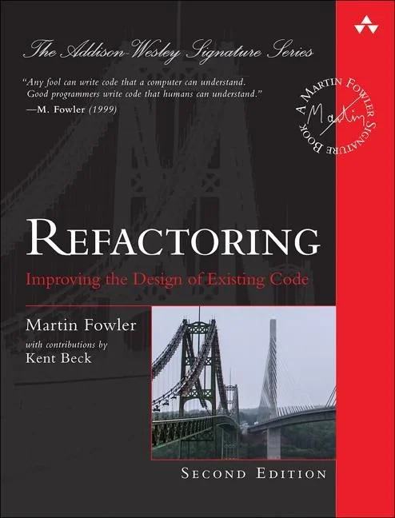

<!-- ABOUT THE PROJECT -->
## About The Project

The main idea of this project is to implement examples of refactoring from marvellous book by **Martin Fowler**
_Refactoring (Improving the Design of Existing Code), Second Edition_ in Go language. 

Code is organized by chapters from the book.
Each chapter contains final code from the related book's chapter.
